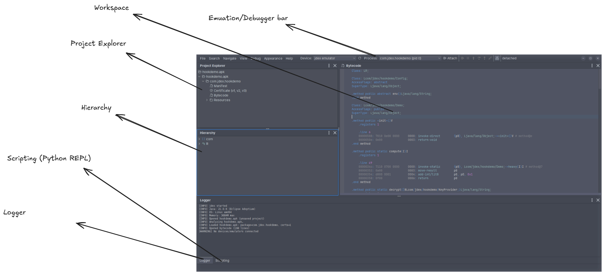

# Overview

jdex is a bytecode-first APK disassembler and decompiler built on [jadx](https://github.com/skylot/jadx), extended with an emulation engine, a Dalvik and native debugger, and an embedded Python scripting console.

The main window is made up of dockable panels — each one can be moved, resized, or hidden, and the layout is remembered between sessions.

## Workspace

The central editor area. Opening a class or method shows it here, with tabs for the different views of the same code: the bytecode-first disassembly, jadx's **Java (Code)** view and the **JDec** emulator-reconstructed variant, the native listing for `.so` code, and a control-flow graph. Several items can stay open side by side as tabs.

## Emulation/Debugger bar

The toolbar across the top for running and debugging. Choose a target — the built-in jdex emulator or a connected Android device over ADB — and a process, then **Attach** and use **Resume**, **Pause**, **Step into**, **Step over**, **Step out**, and **Detach**. It can also pause on uncaught exceptions. The same controls drive both in-process emulation and live on-device debugging.

## Project Explorer

A tree of everything in the loaded APK: packages and classes, resources, the `AndroidManifest.xml`, the signing certificate, and the raw `.dex` files.

## Hierarchy

The structure of the current class — its nested classes, methods, and fields, each marked with a symbol icon — for browsing members and jumping to them in the Workspace.

## Logger

jdex's log output: startup and environment details, analysis progress, and any warnings or errors.

## Scripting (Python REPL)

An embedded Python console (GraalPy) where the `jdex` object is bound, giving programmatic access to the project — navigate and search classes, rename symbols, and drive the emulator and debugger. It offers tab-completion, command history, and a **Stub…** button that exports the API type stub (`jdex.pyi`). It shares the bottom of the window with the Logger.
