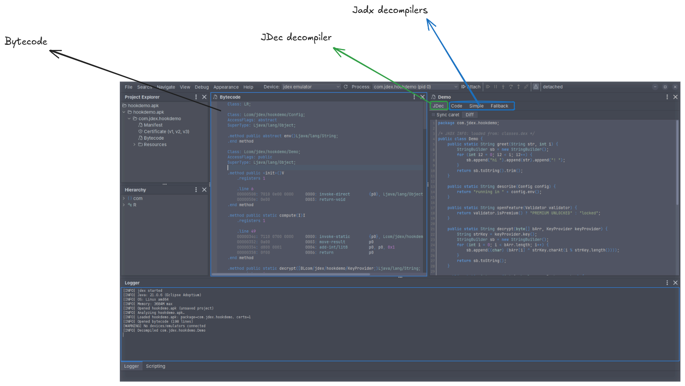
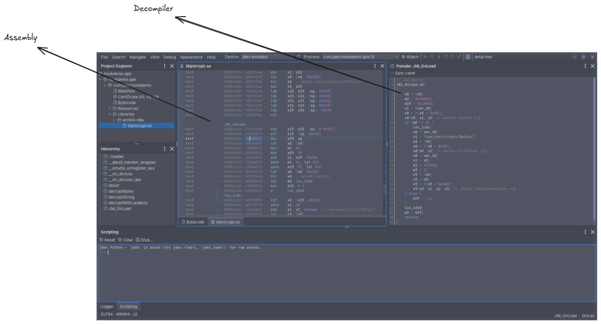

# Decompilers

jdex shows the same class two ways at once: the exact **Bytecode** on the left, and a set of decompilers on the right. Reading them side by side lets you cross-check any reconstructed source against the instructions it came from.

The decompiler panel loads each mode as a tab. A **Sync caret** toggle links the caret between the bytecode and the decompiled source — select a line in one and the matching location is highlighted in the other — for every mode except Fallback.

## Bytecode

The Dalvik bytecode disassembly, and the one exact view: it is the real instructions, so it is the reference everything else is checked against. Each class is shown with its access flags and supertype, and each method with its `.line` markers, dex offsets, raw instruction bytes, and decoded mnemonics and operands.

## JDec decompiler

jdex's own decompiler. It runs the class through the emulation engine to reconstruct and deobfuscate it — decrypting strings, unwrapping reflection, folding opaque predicates, recovering types, and annotating computed values inline — aiming for more readable output than a static decompiler manages on obfuscated code. Because that output is produced by emulation it can be inaccurate, so always cross-check it against **Code**. A **Diff** toggle shows JDec's output against that Code baseline, making it easy to see exactly what the engine changed.

## Jadx decompilers

jadx's own decompilation modes:

- **Code** — the normal, fully structured Java decompilation. This is the primary, most reliable Java view, and the baseline JDec is compared against.
- **Simple** — a less aggressive mode that emits flatter code with explicit `goto`s; useful when the normal structuring comes out wrong or you want something closer to the bytecode.
- **Fallback** — a raw, one-to-one rendering of the instructions as labelled statements, a last resort for methods jadx cannot structure. Caret sync is not available in this mode.

## Native libraries

The same split applies to native code. Open a `.so` from **Project Explorer ▸ Libraries** (for example `arm64-v8a/libjnicrypt.so`) and it opens as an **Assembly** listing, and any function in it can be lifted to a **Pseudo** C decompiler.

### Assembly

The disassembly of the library's code (via Capstone), covering ARM64/ARM, x86/x86-64, and MIPS. Each line shows the address, raw bytes, and decoded mnemonic and operands, with function and local labels (`JNI_OnLoad:`, `loc_1cdc:`), branch lanes down the left edge, and resolved calls annotated inline (`JNIEnv->FindClass`, `JavaVM->GetEnv`, …). The status bar shows the library's format and architecture (for example `ELF64 · ARM64 · LE`) and the function under the caret.

### Decompiler

Press <kbd>Tab</kbd> (or right-click ▸ **Pseudo-C**) on a function to reconstruct it as C-like pseudocode in a **Pseudo: _function_** panel — recovering control flow (`if`/`else`, loops) while keeping the resolved JNI and library calls as inline comments. Like the Java views, it has a **Sync caret** toggle that links the pseudocode back to the matching assembly.
