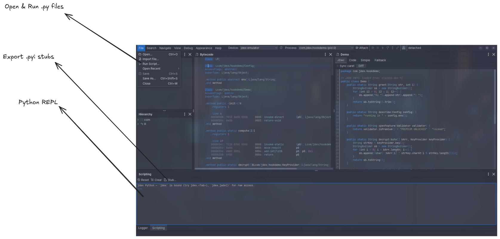

# Scripting

jdex embeds a Python interpreter (GraalPy). The whole project is exposed through a single `jdex` object — navigate and search code, read decompiled sources, rename symbols, drive the emulator and debugger, and automate entire workflows. You can work interactively in the REPL or run `.py` files.



## Python REPL

The **Scripting** panel (at the bottom, next to the Logger) is a live Python console. The `jdex` object is already bound — type `jdex.` and press <kbd>Tab</kbd> to explore it. The console offers:

- Tab-completion, a completion popup on `.`, and a signature hint on `(`
- Command history with <kbd>Up</kbd> / <kbd>Down</kbd>
- `help(obj)` for docstrings
- **Reset** (start a fresh interpreter) and **Clear**

```python
>>> len(jdex.classes())
42
>>> demo = jdex.get_class("com.jdex.hookdemo.Demo")
>>> print(demo.java())          # decompiled Java
>>> print(demo.smali())         # bytecode listing
```

## The `jdex` object

### Navigating and searching

```python
jdex.classes()                     # every class, including inner classes
jdex.get_class("com.foo.Bar")      # by dotted name or 'Lcom/foo/Bar;'
jdex.find_classes(r"Activity$")    # regex over simple name / descriptor
jdex.find_methods(r"->decrypt")    # regex over method descriptors
jdex.find_fields(r"KEY")
jdex.search_code(r"const-string")  # regex over bytecode lines (full scan)
jdex.strings()                     # every string literal (full scan)
```

### Classes, methods and fields

Every class, method and field is identified by its smali descriptor and can be read, renamed, and cross-referenced. Renames are persisted to the project.

```python
c = jdex.get_class("com.foo.Bar")
c.methods(); c.fields()
c.super_class(); c.interfaces()
c.info()                           # dict: access flags, modifiers, ...

m = c.methods()[0]
m.instructions()                   # structured bytecode rows
m.xrefs_to()                       # everything that references this method
m.rename("decryptPayload")         # persisted

f = c.fields()[0]
f.reads(); f.writes()              # methods that read / write the field

jdex.ui.open(m)                    # reveal it in the bytecode view
```

### App metadata and files

```python
jdex.app_package(); jdex.main_activity()
jdex.manifest(); jdex.permissions(); jdex.components("service")
jdex.files()                       # entries inside the APK
jdex.read_file("classes.dex")      # raw bytes of one entry
```

### Emulation and debugging

`jdex.emu` drives the Dalvik emulator, `jdex.native_emu` the native (unidbg, ARM) emulator, `jdex.debug` attaches to a live device, and `jdex.this` is the run currently loaded in the UI. For example, resolve a value by running a method through the emulator:

```python
r = jdex.emu.resolve("Lcom/foo/Bar;->dec([B)Ljava/lang/String;", [b"\x01\x02\x03"])
print(r["return"])
```

A native example — load a library, watch a buffer, trace blocks, and resolve addresses:

```python
ne = jdex.native_emu
ne.load("arm64-v8a/libfoo.so")
buf = ne.malloc(64)
ne.mem_write(buf, b"...ciphertext...")
ne.mem_watch(buf, buf + 64, on_read=lambda a: print("read", hex(a.address())))
ne.trace(lambda b: print("block", hex(b.address())))
print([m["name"] for m in ne.modules()])
print(ne.symbol_at(ne.symbol("Java_com_foo_Bar_dec")))   # {name, module, offset}
```

### Engine configuration

`jdex.config` toggles the deobfuscation engine; each change re-analyses the project.

```python
jdex.config.emulator_enabled = True
jdex.config.code_cleanup = True
jdex.config.apply(decrypt_strings_at_startup=True)
```

### Escape hatch

```python
jdex.jadx()                        # the raw jadx JadxDecompiler, for anything the facade omits
```

## Running script files

Choose **File ▸ Run Script…** to execute a `.py` file in the same interpreter as the REPL — useful for repeatable analyses. Scripts see the same `jdex` object:

```python
# find_decryptors.py
for m in jdex.find_methods(r"->dec"):
    print(m.descriptor)
```

## Exporting the type stub

The **Stub…** button in the Scripting toolbar writes `jdex.pyi`, a type stub for the whole `jdex` API. Point your editor at it to get autocomplete, signatures, and docstrings while writing scripts against jdex.
