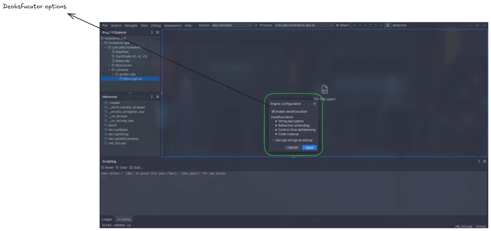
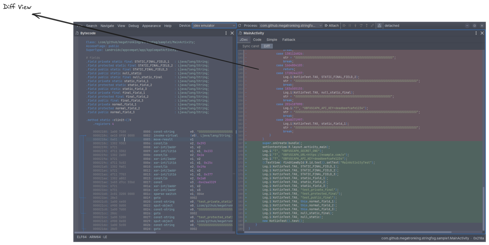

# Deobfuscation

The [JDec decompiler](02-Decompilers.md#jdec-decompiler) runs code through jdex's emulation engine to undo common obfuscation — decrypting strings, unwinding reflection, and rebuilding flattened control flow. What the engine does is configurable per project, and a diff view shows exactly what it recovered.

## Engine configuration

When you open an APK, jdex asks how the engine should treat it. Your choices are remembered as the defaults for next time, and the same settings are available from scripting through [`jdex.config`](03-Scripting.md#engine-configuration).

- **Enable deobfuscation** — the master switch. With it off, the JDec view is simply raw jadx output and none of the passes below run.
- **String decryption** — runs the app's own string decryptors through the emulator and injects the recovered plaintext in place of the encrypted calls.
- **Reflection unwinding** — resolves reflective dispatch (`Method.invoke`, index-keyed dispatchers) and rewrites it as the direct call it stands in for.
- **Control-flow deflattening** — rebuilds flattened, state-machine control flow back into ordinary `if`/loops.
- **Code cleanup** — general tidy-up that also clears the side effects of obfuscation: type recovery, dead- and opaque-branch removal, constant folding, redundant-cast stripping, and CFG repair. (This is one switch rather than several because it is normal codegen you would always want.)
- **Decrypt strings at startup** — decrypt every class's strings when the APK loads, instead of lazily the first time you open each class. Off (the default) makes opening faster; on trades a slower start for strings that are already resolved everywhere.

These settings only affect the **JDec** view; the plain jadx **Code**, **Simple**, and **Fallback** views are untouched, so JDec always has an unmodified baseline to compare against.

## Diff view

In the JDec view, the **Diff** toggle compares JDec's output against that jadx **Code** baseline line by line — the original obfuscated lines on one side, the recovered lines on the other — so you can see precisely what the engine did.

